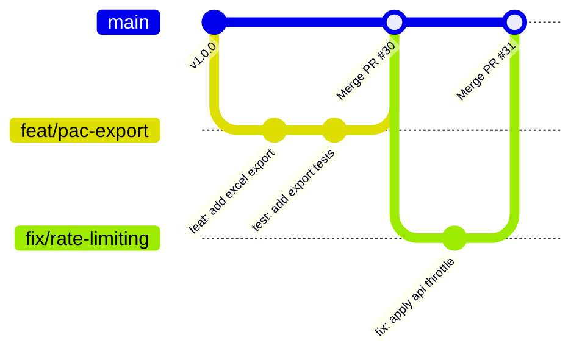

# 🤝 Panduan Kontribusi (Contributing Guidelines)

Terima kasih atas minat Anda untuk berkontribusi pada **KP-IF-SAKTI** (Sistem Informasi Fatayat NU Kabupaten Sukabumi)! Dokumen ini berisi pedoman untuk menjaga kualitas kode, konsistensi alur kerja Git, dan efisiensi kolaborasi tim.

---

## 📑 Daftar Isi

- [Kode Etik](#-kode-etik)
- [Alur Kerja Git (Git Workflow)](#-alur-kerja-git-git-workflow)
- [Konvensi Penamaan Branch](#-konvensi-penamaan-branch)
- [Konvensi Pesan Commit (Conventional Commits)](#-konvensi-pesan-commit-conventional-commits)
- [Standar Koding (Coding Standards)](#-standar-koding-coding-standards)
- [Menjalankan Pengujian (Testing)](#-menjalankan-pengujian-testing)
- [Proses Pengajuan Pull Request (PR)](#-proses-pengajuan-pull-request-pr)
- [Pelaporan Bug & Permintaan Fitur](#-pelaporan-bug--permintaan-fitur)

---

## 📜 Kode Etik

Setiap kontributor diharapkan mematuhi panduan perilaku yang tercantum dalam [CODE_OF_CONDUCT.md](CODE_OF_CONDUCT.md). Kami berkomitmen menciptakan lingkungan yang ramah, inklusif, dan profesional bagi semua orang.

---

## 🚨 ATURAN MUTLAK: DILARANG PUSH LANGSUNG KE `main`

> [!CAUTION]
> ### 🛑 ATURAN UTAMA KONTRIBUSI (STRICT BRANCH POLICY)
> 1. **DILARANG KERAS ngoding atau mengubah kode langsung pada branch `main`.**
> 2. **DILARANG KERAS melakukan `git push` langsung ke branch `main`.**
> 3. Semua pengembangan fitur, perbaikan bug, atau dokumentasi **WAJIB dibuat pada branch baru** (`<tipe>/<nama-singkat>`).
> 4. Perubahan hanya dapat digabungkan ke `main` melalui **Pull Request (PR)** yang telah melewati pengujian automated CI dan disetujui (*code review*).

---

## 🛡️ Mengaktifkan Git Hooks Proteksi Lokal

Repositori ini telah dilengkapi dengan script **Git Hooks otomatis** (`.githooks/`) yang secara otomatis memblokir perintah commit/push jika Anda sedang berada di branch `main`.

Jalankan perintah berikut sekali di komputer lokal Anda untuk mengaktifkan proteksi ini:

```bash
# Aktifkan hooks proteksi lokal
git config core.hooksPath .githooks
chmod +x .githooks/*
```

Jika proteksi aktif, Git akan langsung menolak dan memberikan peringatan jika Anda secara tidak sengaja mencoba commit/push di branch `main`.

---

## 🌿 Alur Kerja Git Standar (Git Workflow)

Proyek ini menggunakan model alur kerja berbasis branch (*Feature Branch Workflow*):



### Langkah Kerja Kontributor:

1. **Sinkronkan branch `main` lokal dengan remote repository**:
   ```bash
   git checkout main
   git pull origin main
   ```
2. **Buat Branch Baru** sebelum mulai menulis atau mengedit kode:
   ```bash
   git checkout -b <tipe>/<nama-singkat-pekerjaan>
   # Contoh fitur baru:   git checkout -b feat/export-kegiatan-pdf
   # Contoh perbaikan bug: git checkout -b fix/image-upload-null
   ```
3. **Tulis kode dan lakukan commit pada branch baru tersebut**:
   ```bash
   git add .
   git commit -m "fix(kegiatan): keep existing image when updating activity"
   ```
4. **Push branch baru ke GitHub**:
   ```bash
   git push origin <nama-branch-anda>
   ```
5. **Buka Pull Request (PR) ke `main`** melalui GitHub Web UI atau GitHub CLI:
   ```bash
   gh pr create --base main --title "fix(kegiatan): ..." --body "Fixes #37"
   ```

---

## 🏷️ Konvensi Penamaan Branch

Gunakan format: `<kategori>/<deskripsi-singkat>` dengan huruf kecil dan tanda hubung (`-`):

| Kategori | Penggunaan | Contoh |
|---|---|---|
| `feat/` | Menambahkan fitur baru | `feat/google-sheet-webhook`, `feat/export-pdf-anggota` |
| `fix/` | Memperbaiki bug atau kesalahan sistem | `fix/pac-distinct-count`, `fix/navbar-login-url` |
| `security/` | Penguatan atau perbaikan keamanan | `security/api-rate-limiting`, `security/csrf-fix` |
| `perf/` | Optimasi performa atau lazy loading | `perf/maplibre-lazy-loading`, `perf/db-indexing` |
| `docs/` | Perubahan atau penambahan dokumentasi | `docs/add-api-documentation`, `docs/update-readme` |
| `refactor/` | Refaktor kode tanpa mengubah fungsionalitas | `refactor/clean-orphaned-views`, `refactor/models` |
| `test/` | Menambah atau memperbaiki automated tests | `test/pac-controller-unit-test` |

---

## 📝 Konvensi Pesan Commit (Conventional Commits)

Kami menerapkan standar **Conventional Commits 1.0.0** agar riwayat commit mudah dibaca dan dapat di-generate otomatis ke dalam `CHANGELOG.md`.

### Format Dasar:
```
<tipe>(<lingkup-opsional>): <deskripsi singkat dalam bahasa indonesia/inggris>

[bodi penjelasan opsional]

[footer opsional: referensi issue atau breaking changes]
```

### Tipe Commit:
- `feat`: Fitur baru bagi pengguna (`feat(api): tambahkan endpoint filter kegiatan berdasarkan tanggal`)
- `fix`: Perbaikan bug sistem (`fix(pac): perbaiki kalkulasi kecamatan unik dengan distinct`)
- `docs`: Perubahan atau pembaruan dokumentasi (`docs: tambahkan dokumentasi skema database`)
- `style`: Perapian format, spasi, titik koma (tidak mengubah logika kode)
- `refactor`: Refaktor kode yang bukan perbaikan bug maupun penambahan fitur
- `perf`: Perubahan kode yang meningkatkan performa
- `test`: Penambahan unit test, feature test, atau pengujian otomatis
- `chore`: Pembaruan konfigurasi build, dependensi package, atau tooling
- `security`: Penguatan keamanan (rate limiting, sanitizer, auth hardening)

### Contoh Commit yang Baik:
```bash
git commit -m "fix(pac): compute unique kecamatan count using distinct column (fixes #24)"
git commit -m "feat(settings): support sqlite driver for database backup and restore (fixes #27)"
git commit -m "docs(api): create comprehensive rest api documentation"
```

---

## 📐 Standar Koding (Coding Standards)

### 1. Backend (PHP / Laravel)
- Mengikuti standar **PSR-12** (PHP Standards Recommendation).
- Selalu gunakan type hinting dan return types jika memungkinkan.
- Gunakan **Laravel Pint** untuk memformat kode secara otomatis:
  ```bash
  cd backend
  vendor/bin/pint
  ```
- Hindari raw query SQL rentan SQL Injection — selalu gunakan Eloquent ORM atau Query Builder dengan parameter binding.
- Validasi semua input pengguna melalui Form Request atau `$request->validate([...])`.

### 2. Frontend (React / JavaScript / Tailwind CSS)
- Gunakan komponen fungsional dengan React Hooks (`useState`, `useEffect`, `useMemo`, `useCallback`).
- Terapkan pemisahan komponen yang bersih di folder `frontend/src/components/` dan halaman di `frontend/src/Pages/`.
- Gunakan utilitas Tailwind CSS 4 (`clsx`, `tailwind-merge`) untuk penggabungan class CSS dinamis.
- Gunakan lazy loading (`React.lazy` + `Suspense`) untuk komponen library besar (seperti WebGL / MapLibre).

---

## 🧪 Menjalankan Pengujian (Testing)

Sebelum membuat Pull Request, pastikan seluruh pengujian lokal berhasil tanpa error:

### 1. Pengujian Backend (Laravel PHPUnit)
```bash
cd backend
php artisan test
```

### 2. Pengecekan Gaya Kode Backend (Laravel Pint)
```bash
cd backend
vendor/bin/pint --test
```

### 3. Pengujian Build Frontend (Vite)
```bash
cd frontend
npm run build
```

---

## 🚀 Proses Pengajuan Pull Request (PR)

1. **Push branch Anda ke repository**:
   ```bash
   git push origin <nama-branch-anda>
   ```
2. **Buka Pull Request** melalui antarmuka GitHub:
   - Berikan judul PR yang jelas sesuai Conventional Commits (misal: `feat(pac): add export excel functionality`).
   - Jelaskan latar belakang perubahan, pendekatan solusi, dan file apa saja yang diubah.
   - Tautkan issue yang diselesaikan dengan sintaks `Fixes #24` atau `Closes #25`.
3. **Pastikan GitHub Actions CI lolos**:
   - Job `Backend Tests (Laravel)`: PASS
   - Job `Frontend Build (Vite + React)`: PASS
4. **Tinjauan Kode (Code Review)**:
   - Minimal satu core maintainer / reviewer akan memeriksa kode Anda sebelum proses merge.
   - Jika ada saran perbaikan, lakukan commit tambahan pada branch yang sama.

---

## 🐛 Pelaporan Bug & Permintaan Fitur

Jika Anda menemukan bug atau memiliki ide fitur baru:
1. Periksa daftar issue aktif di [GitHub Issues](https://github.com/ikhsanhazamy/KP-IF-SAKTI/issues) untuk menghindari duplikasi.
2. Buat Issue Baru dengan menyertakan:
   - **Langkah-langkah mereproduksi bug (Steps to Reproduce)**.
   - **Perilaku yang diharapkan (Expected Behavior)**.
   - **Perilaku aktual yang terjadi (Actual Behavior)**.
   - **Tangkapan layar / Screenshot** (jika berupa masalah antarmuka atau error visual).
   - **Detail lingkungan**: OS, browser, versi Node/PHP, Docker vs Host.
