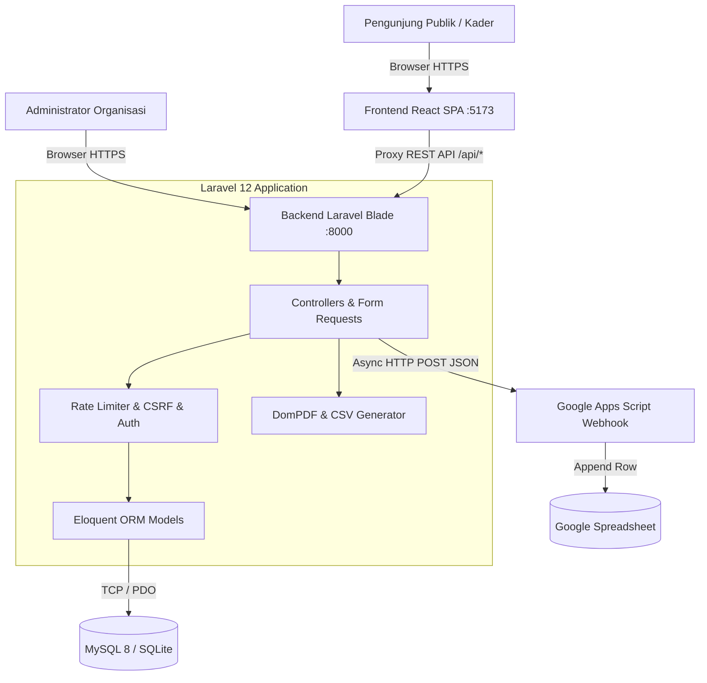
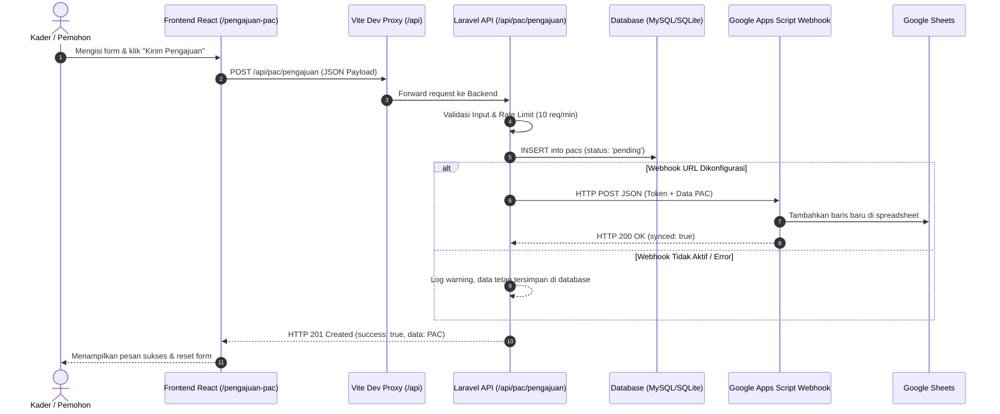
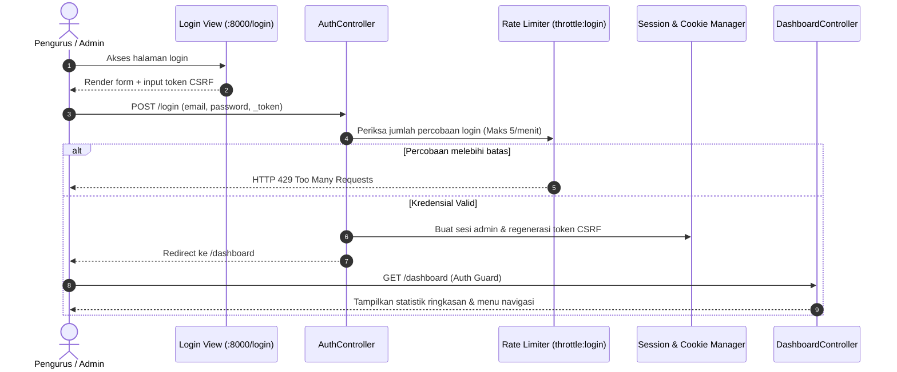

# 🏛️ Arsitektur Sistem — KP-IF-SAKTI

Dokumen ini menjelaskan rancangan arsitektur perangkat lunak, aliran data (*data flow*), interaksi antar-layanan, dan integrasi pihak ketiga pada sistem informasi **KP-IF-SAKTI**.

---

## 📐 Gambaran Umum Arsitektur (High-Level Architecture)

Sistem KP-IF-SAKTI menggunakan pola **Hybrid Architecture**:
1. **Frontend Publik (Client Tier)**: Menggunakan Single Page Application (SPA) berbasis **React 18 + Vite** yang cepat, responsif, dan ringan untuk masyarakat umum dan kader.
2. **Backend & Admin Dashboard (Application Tier)**: Menggunakan **Laravel 12 (PHP 8.2)** yang menyediakan REST API JSON untuk frontend SPA sekaligus Server-Side Rendered (SSR) Blade Views untuk dashboard manajemen internal admin.
3. **Database Tier**: Relational Database Management System (**MySQL 8** pada environment Docker / Produksi, atau **SQLite** untuk pengujian cepat & backup fleksibel).
4. **Third-Party Integration**: **Google Apps Script Webhook** untuk sinkronisasi pengajuan PAC ke Google Sheets secara real-time.

---

## 🔄 Aliran Data (Data Flow Diagrams)

### 1. Alur Pengajuan PAC Publik ke Sistem & Google Sheets

---

### 2. Alur Akses Dashboard Admin & Keamanan

---

## 📦 Komponen Utama & Pola Desain (Design Patterns)

| Komponen | Pola Desain | Deskripsi |
|---|---|---|
| **Controller-Model-View (MVC)** | MVC Pattern | Pemisahan jelas antara logika bisnis (`Controllers`), representasi data (`Models`), dan antarmuka pengguna (`Views/Blade`). |
| **API Resources / JSON Response** | RESTful Pattern | Standardisasi respons API dengan status code HTTP yang semantik (`200`, `201`, `422`, `429`). |
| **Middleware Pipeline** | Chain of Responsibility | Penanganan request bertahap: enkripsi cookie -> verifikasi CSRF -> rate limiting -> otentikasi sesi. |
| **Component-Based UI** | Reusable Components | Komponen frontend modular di React (Navbar, Footer, MapSection, StatCards) yang dapat digunakan berulang. |
| **Database Driver Abstraction** | Strategy Pattern | Abstraksi driver database (`mysql`, `sqlite`) yang memungkinkan fitur backup/restore berjalan mulus di berbagai lingkungan. |

---

## 🛡️ Topologi Jaringan & Isolasi Docker

Dalam arsitektur Docker Compose, layanan diatur dalam satu network internal tertutup (`kp_network`):
- **`app`**: Service backend PHP 8.2 terhubung langsung dengan container database `db`.
- **`db`**: MySQL 8 berjalan pada port internal `3306` dan hanya dapat diakses oleh container `app`.
- **`node`**: Dev server Vite berjalan pada port `5173` dan mem-proxy request API langsung ke service `http://app:8000`.
- **`backend-assets`**: Builder sementara untuk memproses aset CSS/JS Laravel dashboard menggunakan Vite.
