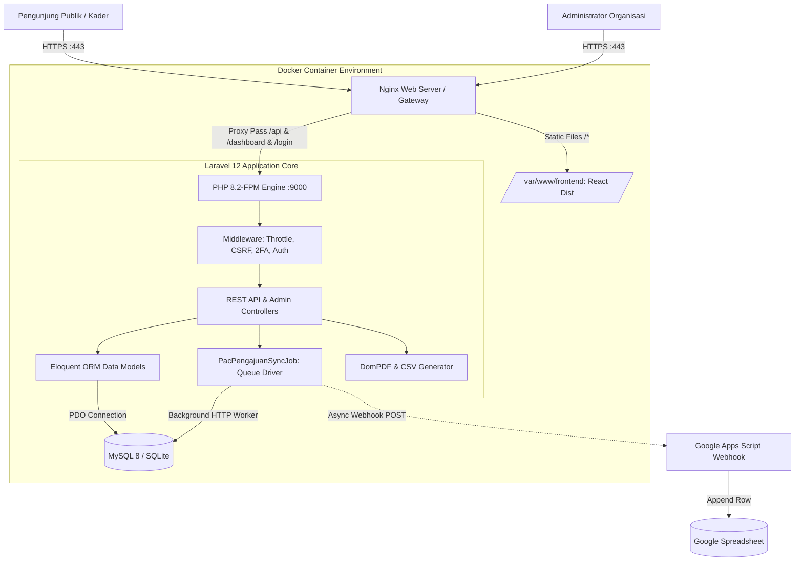
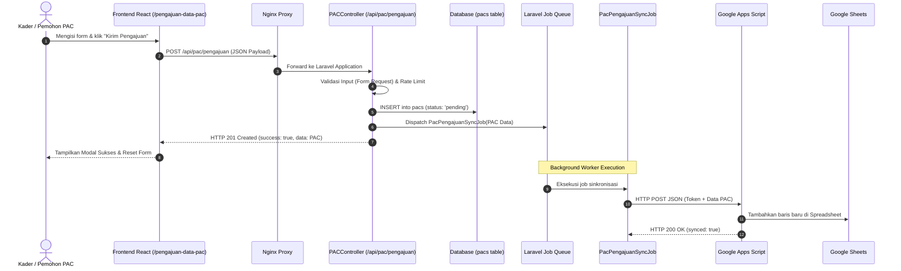
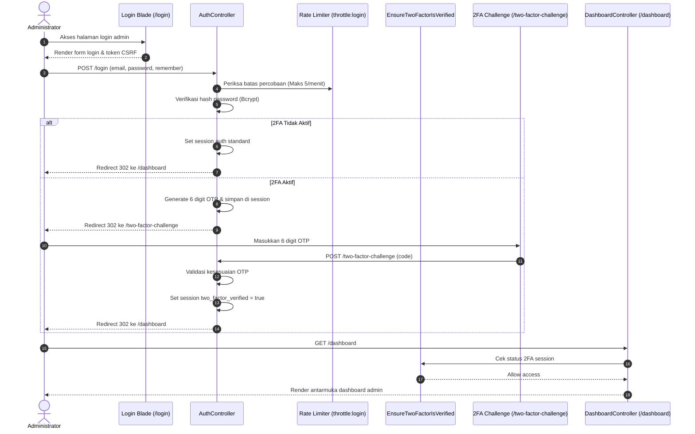

# 🏛️ Arsitektur Sistem — KP-IF-SAKTI

Dokumen ini menjelaskan rancangan arsitektur perangkat lunak, aliran data (*data flow*), interaksi antar-layanan, topologi kontainer Docker, dan integrasi pihak ketiga pada sistem informasi **KP-IF-SAKTI**.

---

## 📐 Gambaran Umum Arsitektur (High-Level Architecture)

Sistem KP-IF-SAKTI mengusung pola **Modern Hybrid Architecture** yang memadukan performa antarmuka pengguna SPA dengan keandalan dan keamanan framework enterprise:

1. **Frontend Publik (Presentation Tier)**:
   - Single Page Application (SPA) berbasis **React 18 + Vite 5**.
   - Styling modern dan token-based menggunakan **Tailwind CSS 4**.
   - Visualisasi pemetaan interaktif 47 PAC menggunakan **MapLibre GL**.
   - Konsumsi REST API asinkron melalui proxy Vite / Nginx.

2. **Backend & Admin Dashboard (Application Tier)**:
   - Framework **Laravel 12 (PHP 8.2-FPM)**.
   - Dual interface: **RESTful API Engine** untuk publik dan **Server-Side Rendered (SSR) Blade Views** untuk Dashboard Admin.
   - Keamanan enterprise: Session Authentication, Two-Factor Authentication (2FA OTP), Rate Limiting, dan Proteksi CSRF.
   - Background Job Queue untuk integrasi pihak ketiga secara non-blocking.

3. **Basis Data & Persistensi (Database Tier)**:
   - **MySQL 8.0** pada lingkungan Docker / Produksi dengan indexed query optimization.
   - **SQLite 3** untuk lingkungan pengujian otomatis (PHPUnit) dan fitur backup/restore portabel.

4. **Integrasi Eksternal & Webhook**:
   - **Google Apps Script Webhook** untuk sinkronisasi pengajuan PAC ke Google Sheets secara real-time.



---

## 🔄 Aliran Data & Diagram Sekuensial (Sequence Diagrams)

### 1. Alur Pengajuan PAC Publik (Asynchronous Webhook Queue)

Formulir permohonan pembentukan PAC diproses secara aman dan langsung tersimpan ke database, sementara sinkronisasi ke Google Spreadsheet dijalankan melalui antrean asinkron (*job queue*) agar performa form tetap instan:



---

### 2. Alur Otentikasi Admin & Verifikasi Dua Faktor (2FA Challenge)

Pengamanan login admin dilengkapi dengan verifikasi OTP jika fitur 2FA diaktifkan pada profil pengguna:



---

## 🛡️ Pipeline Middleware & Keamanan Sistem

Request yang masuk ke backend diproses melalui lapisan keamanan berjenjang (*Chain of Responsibility*):

1. **`TrustProxies`**: Menentukan IP asli klien di balik Nginx reverse proxy.
2. **`ValidateCsrfToken`**: Memvalidasi token CSRF pada seluruh request POST/PUT/DELETE web.
3. **`ThrottleRequests` (`throttle:api`, `throttle:login`)**: Membatasi laju request per IP untuk mencegah serangan DoS dan brute-force.
4. **`Authenticate` (`auth`)**: Memverifikasi keberadaan session login aktif untuk rute admin.
5. **`EnsureTwoFactorIsVerified`**: Menghadang akses dashboard jika user mengaktifkan 2FA namun belum memasukkan kode OTP yang valid.

---

## 🐳 Topologi Kontainer & Jaringan Docker

Sistem berjalan secara terisolasi menggunakan Docker Compose:

| Service | Image / Base | Port Internal | Port Eksternal | Fungsi |
|---|---|---|---|---|
| **`app`** | PHP 8.2-FPM + Nginx + Supervisor | `80` | `8000:80` | Web server Nginx terintegrasi, melayani static frontend build, PHP API, dan admin Blade. |
| **`db`** | `mysql:8.0` | `3306` | - | Database server relasional dengan persistent volume `db_data`. |
| **`frontend-build`**| `node:22-alpine` | - | - | Runner build sekali jalan untuk mengompilasi aset React ke volume `frontend_dist`. |
| **`backend-assets`**| `node:22-alpine` | - | - | Runner build sekali jalan untuk mengompilasi aset dashboard Laravel Vite. |

---

## 📁 Struktur Direktori & Tanggung Jawab Modul

```text
KP-IF-SAKTI/
├── .github/                   # Konfigurasi GitHub Actions CI & PR Templates
├── backend/                   # Core Aplikasi Laravel 12
│   ├── app/
│   │   ├── Http/Controllers/ # Kontroller API & Dashboard Blade
│   │   ├── Http/Middleware/  # Middleware Keamanan & 2FA
│   │   ├── Jobs/             # Asynchronous Queue Jobs (GAS Sync)
│   │   └── Models/           # Eloquent ORM Models (PAC, Anggota, Kegiatan)
│   ├── config/               # Konfigurasi Framework, Database, Services
│   ├── database/             # Migrations, Seeders, Factories
│   ├── resources/views/      # Blade Template Dashboard Admin
│   ├── routes/               # api.php, web.php, console.php
│   └── tests/                # Feature & Unit Tests (PHPUnit)
├── docker/                    # Konfigurasi Nginx, PHP, dan Supervisor
├── docs/                      # Dokumentasi Teknis & Panduan
├── frontend/                  # Aplikasi React 18 SPA (Vite)
│   ├── src/
│   │   ├── components/       # Komponen Antarmuka Modular (Navbar, Map, Cards)
│   │   ├── Pages/            # Halaman Utama SPA (Home, DataPAC, Kegiatan)
│   │   └── assets/           # Ikon, Logo SVG, dan Gambar
└── docker-compose.yml         # Konfigurasi Multi-Container Produksi/Dev
```
