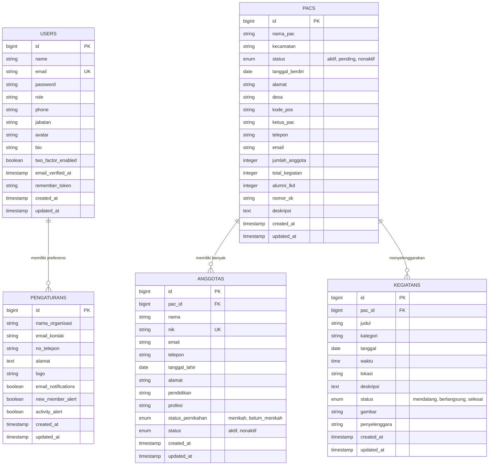

# 🗄️ Dokumentasi Skema Basis Data (Database Schema)

Dokumen ini menjelaskan struktur relasional, kamus data (*data dictionary*), indeks performa, dan Entity-Relationship Diagram (ERD) untuk basis data aplikasi **KP-IF-SAKTI**.

---

## 📊 Entity-Relationship Diagram (ERD)

---

## 📋 Kamus Data Tabel (Data Dictionary)

### 1. Tabel `users`
Menyimpan kredensial dan data akun administrator dashboard.

| Nama Kolom | Tipe Data | Nullable? | Keterangan / Default |
|---|---|---|---|
| `id` | `BIGINT UNSIGNED` | Tidak | Primary Key (Auto Increment) |
| `name` | `VARCHAR(255)` | Tidak | Nama lengkap administrator |
| `email` | `VARCHAR(255)` | Tidak | Alamat email login (Unique) |
| `password` | `VARCHAR(255)` | Tidak | Hash kata sandi (Bcrypt) |
| `role` | `VARCHAR(50)` | Ya | Hak akses (default: `admin`) |
| `phone` | `VARCHAR(20)` | Ya | Nomor telepon/WhatsApp admin |
| `jabatan` | `VARCHAR(100)` | Ya | Jabatan organisasi (misal: "Sekretaris PC") |
| `avatar` | `VARCHAR(255)` | Ya | Path berkas foto profil admin di storage |
| `bio` | `TEXT` | Ya | Catatan biografi singkat admin |
| `two_factor_enabled` | `BOOLEAN` | Tidak | Status preferensi 2FA (default: `false`) |
| `email_verified_at` | `TIMESTAMP` | Ya | Waktu verifikasi email |
| `remember_token` | `VARCHAR(100)` | Ya | Token "Remember Me" session |
| `created_at` / `updated_at` | `TIMESTAMP` | Ya | Waktu pembuatan & modifikasi |

---

### 2. Tabel `pacs`
Menyimpan data Pimpinan Anak Cabang (PAC) Fatayat NU tingkat kecamatan.

| Nama Kolom | Tipe Data | Nullable? | Keterangan / Default |
|---|---|---|---|
| `id` | `BIGINT UNSIGNED` | Tidak | Primary Key (Auto Increment) |
| `nama_pac` | `VARCHAR(255)` | Tidak | Nama PAC (contoh: "PAC Cisaat") |
| `kecamatan` | `VARCHAR(255)` | Tidak | Nama kecamatan (Indexed) |
| `status` | `VARCHAR(50)` | Tidak | Status organisasi: `aktif`, `pending`, `nonaktif` (Indexed) |
| `tanggal_berdiri` | `DATE` | Tidak | Tanggal resmi pendirian/pembentukan PAC |
| `alamat` | `TEXT` | Ya | Alamat fisik kantor sekretariat PAC |
| `desa` | `VARCHAR(255)` | Ya | Nama desa/kelurahan sekretariat |
| `kode_pos` | `VARCHAR(10)` | Ya | Kode pos sekretariat |
| `ketua_pac` | `VARCHAR(255)` | Tidak | Nama lengkap ketua PAC |
| `telepon` | `VARCHAR(20)` | Tidak | Nomor telepon/kontak PAC |
| `email` | `VARCHAR(255)` | Ya | Email resmi PAC |
| `jumlah_anggota` | `INT` | Tidak | Jumlah total anggota terdaftar (default: `0`) |
| `total_kegiatan` | `INT` | Tidak | Jumlah total kegiatan (default: `0`) |
| `alumni_lkd` | `INT` | Ya | Jumlah alumni Latihan Kader Dasar (default: `0`) |
| `nomor_sk` | `VARCHAR(255)` | Ya | Nomor Surat Keputusan (SK) kepengurusan |
| `deskripsi` | `TEXT` | Ya | Profil atau deskripsi ringkas PAC |
| `created_at` / `updated_at` | `TIMESTAMP` | Ya | Waktu pembuatan & modifikasi |

---

### 3. Tabel `anggotas`
Menyimpan data kader dan anggota Fatayat NU.

| Nama Kolom | Tipe Data | Nullable? | Keterangan / Default |
|---|---|---|---|
| `id` | `BIGINT UNSIGNED` | Tidak | Primary Key (Auto Increment) |
| `pac_id` | `BIGINT UNSIGNED` | Ya | Foreign Key ke tabel `pacs(id)` (onDelete: CASCADE / SET NULL) |
| `nama` | `VARCHAR(255)` | Tidak | Nama lengkap anggota |
| `nik` | `VARCHAR(20)` | Ya | Nomor Induk Kependudukan (Indexed) |
| `email` | `VARCHAR(255)` | Ya | Alamat email anggota |
| `telepon` | `VARCHAR(20)` | Ya | Nomor telepon/WhatsApp |
| `tanggal_lahir` | `DATE` | Ya | Tanggal lahir anggota |
| `alamat` | `TEXT` | Ya | Alamat domisili |
| `pendidikan` | `VARCHAR(100)` | Ya | Jenjang pendidikan terakhir (SMA, S1, S2, dll.) |
| `profesi` | `VARCHAR(100)` | Ya | Profesi / pekerjaan |
| `status_pernikahan` | `VARCHAR(50)` | Ya | Status pernikahan (`menikah`, `belum_menikah`) |
| `status` | `VARCHAR(50)` | Tidak | Status keanggotaan: `aktif`, `nonaktif` (default: `aktif`, Indexed) |
| `created_at` / `updated_at` | `TIMESTAMP` | Ya | Waktu pembuatan & modifikasi |

---

### 4. Tabel `kegiatans`
Menyimpan data agenda dan kegiatan organisasi.

| Nama Kolom | Tipe Data | Nullable? | Keterangan / Default |
|---|---|---|---|
| `id` | `BIGINT UNSIGNED` | Tidak | Primary Key (Auto Increment) |
| `pac_id` | `BIGINT UNSIGNED` | Ya | Foreign Key ke tabel `pacs(id)` penyelenggara |
| `judul` | `VARCHAR(255)` | Tidak | Judul nama kegiatan |
| `kategori` | `VARCHAR(100)` | Tidak | Kategori kegiatan (`Kaderisasi`, `Sosial`, dll. Indexed) |
| `tanggal` | `DATE` | Tidak | Tanggal pelaksanaan |
| `waktu` | `TIME` | Ya | Waktu mulai acara |
| `lokasi` | `VARCHAR(255)` | Tidak | Lokasi pelaksanaan acara |
| `deskripsi` | `TEXT` | Ya | Deskripsi dan ulasan kegiatan |
| `status` | `VARCHAR(50)` | Tidak | Status: `mendatang`, `berlangsung`, `selesai` (Indexed) |
| `gambar` | `VARCHAR(255)` | Ya | Path file banner/foto kegiatan di storage |
| `penyelenggara` | `VARCHAR(255)` | Ya | Lembaga penyelenggara |
| `created_at` / `updated_at` | `TIMESTAMP` | Ya | Waktu pembuatan & modifikasi |

---

### 5. Tabel `pengaturans`
Menyimpan konfigurasi umum instansi dan preferensi sistem.

| Nama Kolom | Tipe Data | Nullable? | Keterangan / Default |
|---|---|---|---|
| `id` | `BIGINT UNSIGNED` | Tidak | Primary Key |
| `nama_organisasi` | `VARCHAR(255)` | Tidak | Default: "Fatayat NU Kab. Sukabumi" |
| `email_kontak` | `VARCHAR(255)` | Ya | Email resmi kontak sekretariat |
| `no_telepon` | `VARCHAR(50)` | Ya | Nomor kontak telepon organisasi |
| `alamat` | `TEXT` | Ya | Alamat kantor cabang |
| `logo` | `VARCHAR(255)` | Ya | Path file logo instansi |
| `email_notifications` | `BOOLEAN` | Tidak | Toggle notifikasi email (default: `true`) |
| `new_member_alert` | `BOOLEAN` | Tidak | Toggle notifikasi anggota baru (default: `true`) |
| `activity_alert` | `BOOLEAN` | Tidak | Toggle notifikasi kegiatan baru (default: `true`) |
| `created_at` / `updated_at` | `TIMESTAMP` | Ya | Waktu pembuatan & modifikasi |

---

## ⚡ Indeks & Optimasi Performa (Performance Indexes)

Untuk menjamin performa tinggi saat menangani puluhan PAC dan ribuan anggota:
1. `pacs(status)` dan `pacs(kecamatan)` — Mempercepat kalkulasi statistik dan filter pemetaan.
2. `anggotas(status)` dan `anggotas(pac_id)` — Mempercepat query relasi anggota per cabang dan filter keaktifan.
3. `kegiatans(status)`, `kegiatans(kategori)`, dan `kegiatans(tanggal)` — Mempercepat pencarian dan penyaringan rute API publik.
