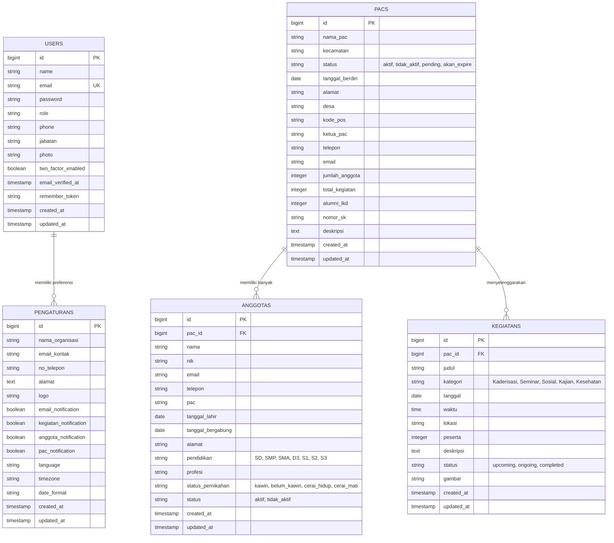

# 🗄️ Dokumentasi Skema Basis Data (Database Schema)

Dokumen ini menjelaskan struktur relasional, kamus data terperinci (*data dictionary*), indeks performa, aturan integritas referensial, dan Entity-Relationship Diagram (ERD) untuk basis data aplikasi **KP-IF-SAKTI**.

---

## 📊 Entity-Relationship Diagram (ERD)

---

## 📋 Kamus Data Tabel (Data Dictionary)

### 1. Tabel `users`
Menyimpan kredensial dan preferensi keamanan administrator dashboard.

| Nama Kolom | Tipe Data | Nullable? | Keterangan / Default |
|---|---|---|---|
| `id` | `BIGINT UNSIGNED` | Tidak | Primary Key (Auto Increment) |
| `name` | `VARCHAR(255)` | Tidak | Nama lengkap administrator |
| `email` | `VARCHAR(255)` | Tidak | Alamat email login (**Unique Index**) |
| `password` | `VARCHAR(255)` | Tidak | Hash kata sandi akun (Bcrypt) |
| `role` | `VARCHAR(50)` | Ya | Hak akses sistem (default: `admin`) |
| `phone` | `VARCHAR(20)` | Ya | Nomor telepon/WhatsApp pengurus |
| `jabatan` | `VARCHAR(100)` | Ya | Jabatan formal organisasi (misal: "Ketua PC", "Sekretaris") |
| `photo` | `VARCHAR(255)` | Ya | Path berkas foto profil tersimpan di storage |
| `two_factor_enabled` | `BOOLEAN` | Tidak | Status aktifasi autentikasi 2FA OTP (default: `false`) |
| `email_verified_at` | `TIMESTAMP` | Ya | Waktu verifikasi email |
| `remember_token` | `VARCHAR(100)` | Ya | Token "Ingat Saya" untuk persistensi sesi |
| `created_at` / `updated_at` | `TIMESTAMP` | Ya | Timestamp pencatatan & pembaruan |

---

### 2. Tabel `pacs`
Menyimpan entitas Pimpinan Anak Cabang (PAC) Fatayat NU tingkat kecamatan.

| Nama Kolom | Tipe Data | Nullable? | Keterangan / Default |
|---|---|---|---|
| `id` | `BIGINT UNSIGNED` | Tidak | Primary Key (Auto Increment) |
| `nama_pac` | `VARCHAR(255)` | Tidak | Nama organisasi PAC (contoh: "PAC Cisaat") |
| `kecamatan` | `VARCHAR(255)` | Tidak | Nama kecamatan (**Indexed**) |
| `status` | `VARCHAR(50)` | Tidak | Status PAC: `aktif`, `tidak_aktif`, `pending`, `akan_expire` (**Indexed**) |
| `tanggal_berdiri` | `DATE` | Tidak | Tanggal resmi pendirian/pembentukan |
| `alamat` | `TEXT` | Ya | Alamat kantor sekretariat PAC |
| `desa` | `VARCHAR(255)` | Ya | Nama desa/kelurahan lokasi sekretariat |
| `kode_pos` | `VARCHAR(10)` | Ya | Kode pos sekretariat |
| `ketua_pac` | `VARCHAR(255)` | Tidak | Nama lengkap ketua PAC |
| `telepon` | `VARCHAR(20)` | Tidak | Kontak telepon/WhatsApp PAC |
| `email` | `VARCHAR(255)` | Ya | Email resmi surat-menyurat PAC |
| `jumlah_anggota` | `INT` | Tidak | Jumlah anggota terdaftar (default: `0`) |
| `total_kegiatan` | `INT` | Tidak | Jumlah kegiatan yang diselenggarakan (default: `0`) |
| `alumni_lkd` | `INT` | Ya | Jumlah kader lulusan LKD (default: `0`) |
| `nomor_sk` | `VARCHAR(255)` | Ya | Nomor Surat Keputusan kepengurusan resmi |
| `deskripsi` | `TEXT` | Ya | Catatan profil, visi, atau latar belakang PAC |
| `created_at` / `updated_at` | `TIMESTAMP` | Ya | Timestamp pencatatan & pembaruan |

---

### 3. Tabel `anggotas`
Menyimpan data biodata anggota dan kader Fatayat NU.

| Nama Kolom | Tipe Data | Nullable? | Keterangan / Default |
|---|---|---|---|
| `id` | `BIGINT UNSIGNED` | Tidak | Primary Key (Auto Increment) |
| `pac_id` | `BIGINT UNSIGNED` | Ya | Foreign Key ke `pacs(id)` (`ON DELETE SET NULL`) |
| `pac` | `VARCHAR(255)` | Tidak | Nama PAC penempatan anggota |
| `nama` | `VARCHAR(255)` | Tidak | Nama lengkap anggota kader |
| `nik` | `VARCHAR(20)` | Ya | Nomor Induk Kependudukan |
| `email` | `VARCHAR(255)` | Ya | Alamat email anggota |
| `telepon` | `VARCHAR(20)` | Ya | Nomor telepon/WhatsApp |
| `tanggal_lahir` | `DATE` | Ya | Tanggal lahir (digunakan untuk kalkulasi umur dinamis) |
| `tanggal_bergabung` | `DATE` | Ya | Tanggal mulai bergabung ke organisasi |
| `alamat` | `TEXT` | Ya | Alamat domisili lengkap |
| `pendidikan` | `VARCHAR(50)` | Ya | Jenjang: `SD`, `SMP`, `SMA`, `D3`, `S1`, `S2`, `S3` |
| `profesi` | `VARCHAR(100)` | Ya | Profesi / pekerjaan kader |
| `status_pernikahan` | `VARCHAR(50)` | Ya | Status: `kawin`, `belum_kawin`, `cerai_hidup`, `cerai_mati` |
| `status` | `VARCHAR(50)` | Tidak | Status keanggotaan: `aktif`, `tidak_aktif` (default: `aktif`, **Indexed**) |
| `created_at` / `updated_at` | `TIMESTAMP` | Ya | Timestamp pencatatan & pembaruan |

---

### 4. Tabel `kegiatans`
Menyimpan agenda, pengumuman, dan riwayat kegiatan organisasi.

| Nama Kolom | Tipe Data | Nullable? | Keterangan / Default |
|---|---|---|---|
| `id` | `BIGINT UNSIGNED` | Tidak | Primary Key (Auto Increment) |
| `pac_id` | `BIGINT UNSIGNED` | Ya | Foreign Key ke `pacs(id)` penyelenggara (`ON DELETE SET NULL`) |
| `judul` | `VARCHAR(255)` | Tidak | Judul nama kegiatan |
| `kategori` | `VARCHAR(100)` | Tidak | Kategori: `Kaderisasi`, `Seminar`, `Sosial`, `Kajian`, `Kesehatan` (**Indexed**) |
| `tanggal` | `DATE` | Tidak | Tanggal pelaksanaan kegiatan (**Indexed**) |
| `waktu` | `TIME` | Ya | Waktu mulai acara |
| `lokasi` | `VARCHAR(255)` | Tidak | Lokasi pelaksanaan acara |
| `peserta` | `INT` | Ya | Estimasi/jumlah peserta yang hadir |
| `deskripsi` | `TEXT` | Ya | Ulasan dan rincian kegiatan |
| `status` | `VARCHAR(50)` | Tidak | Status: `upcoming`, `ongoing`, `completed` (default: `upcoming`, **Indexed**) |
| `gambar` | `VARCHAR(255)` | Ya | Path berkas poster/foto kegiatan terkompresi di storage |
| `created_at` / `updated_at` | `TIMESTAMP` | Ya | Timestamp pencatatan & pembaruan |

---

### 5. Tabel `pengaturans`
Menyimpan preferensi konfigurasi instansi, notifikasi, dan pengaturan sistem.

| Nama Kolom | Tipe Data | Nullable? | Keterangan / Default |
|---|---|---|---|
| `id` | `BIGINT UNSIGNED` | Tidak | Primary Key |
| `nama_organisasi` | `VARCHAR(255)` | Tidak | Default: "Fatayat NU Kab. Sukabumi" |
| `email_kontak` | `VARCHAR(255)` | Ya | Email resmi kontak sekretariat |
| `no_telepon` | `VARCHAR(50)` | Ya | Nomor kontak telepon organisasi |
| `alamat` | `TEXT` | Ya | Alamat kantor cabang |
| `logo` | `VARCHAR(255)` | Ya | Path file logo instansi |
| `email_notification` | `BOOLEAN` | Tidak | Toggle notifikasi email (default: `true`) |
| `kegiatan_notification` | `BOOLEAN` | Tidak | Toggle notifikasi kegiatan baru (default: `true`) |
| `anggota_notification` | `BOOLEAN` | Tidak | Toggle notifikasi anggota baru (default: `true`) |
| `pac_notification` | `BOOLEAN` | Tidak | Toggle notifikasi perubahan PAC (default: `true`) |
| `language` | `VARCHAR(10)` | Tidak | Bahasa antarmuka (default: `id`) |
| `timezone` | `VARCHAR(50)` | Tidak | Zona waktu sistem (default: `Asia/Jakarta`) |
| `date_format` | `VARCHAR(20)` | Tidak | Format tampilan tanggal (default: `d-m-Y`) |
| `created_at` / `updated_at` | `TIMESTAMP` | Ya | Timestamp pencatatan & pembaruan |

---

### 6. Tabel Sistem Pendukung Laravel

- **`jobs` & `failed_jobs`**: Mengelola antrean pengiriman background task asinkron (misal: webhook Google Apps Script).
- **`sessions`**: Menyimpan data session autentikasi saat `SESSION_DRIVER=database`.
- **`cache` & `cache_locks`**: Menyimpan caching query dan atomic locks saat `CACHE_STORE=database`.

---

## ⚡ Indeks & Optimasi Performa (Database Indexing)

Untuk memastikan respons kueri tetap di bawah **50ms** saat data bertumbuh:

1. **`pacs(status)`** dan **`pacs(kecamatan)`**: Mengoptimalkan endpoint `/api/pac`, kalkulasi `total_kecamatan` unik, dan filter pemetaan.
2. **`anggotas(status)`**, **`anggotas(pac_id)`**, dan **`anggotas(pac)`**: Mengoptimalkan agregasi jumlah kader per PAC tanpa *table scan*.
3. **`kegiatans(status)`**, **`kegiatans(kategori)`**, dan **`kegiatans(tanggal)`**: Mengoptimalkan filter dan sorting pada rute `/api/kegiatan`.
